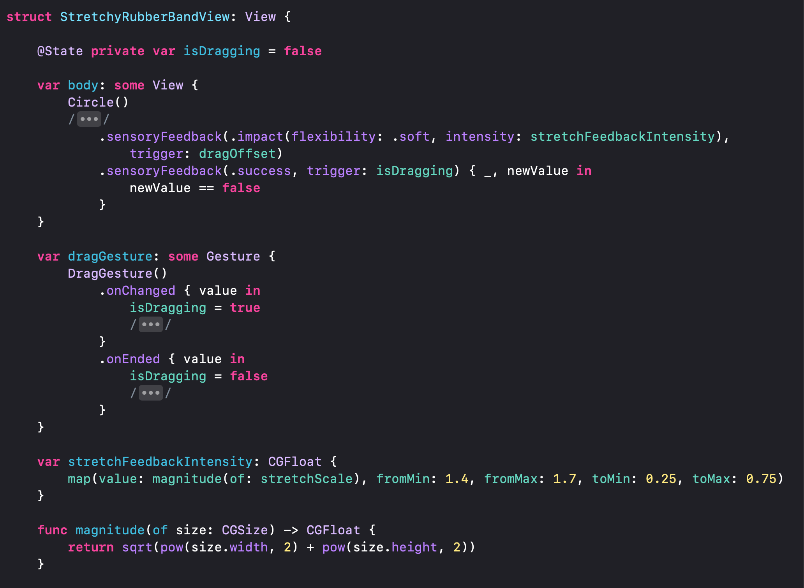

## SwiftUI Stretchy Rubber Band View

https://github.com/sureshsharmaxyz/SwiftUIStretchyRubberBandView/assets/138102501/1a6b7b03-42d2-47b5-9462-ad6449743f7b

Recreation of the rubber band + stretch effect seen in @rickwaalders post on X: 
https://x.com/rickwaalders/status/1759180830784569678

### Step 1 - Dragging the view:
- Add a drag gesture to offset the view
- Reset the dragOffset to zero with a spring animation when the drag ends

https://github.com/sureshsharmaxyz/SwiftUIStretchyRubberBandView/assets/138102501/679fceef-82e5-48ef-8627-a594cb1f1571

### Step 2 - Constrain the drag
- The naive approach:
  - Limit the width and height of the drag
  - Causes the view to be bound within a square, which is not exactly ideal
  - 

https://github.com/sureshsharmaxyz/SwiftUIStretchyRubberBandView/assets/138102501/d2854743-71c8-43c9-8c97-a1ae225b99c5

- The better solution:
    - Ideally, we want to limit the max distance that the view can be dragged away from the center
    - This constrains the view within a circle, which feels nicer
    - 

https://github.com/sureshsharmaxyz/SwiftUIStretchyRubberBandView/assets/138102501/eb5b76f7-fd2a-41ce-afd6-9a6e7fcf6569

### Step 3 - Add the stretch
- Add a scale effect to the view
- The longer the width and height of the drag's translation, the more the view scales in x and y respectively
- I played around with these numbers until the interaction felt good
- 

https://github.com/sureshsharmaxyz/SwiftUIStretchyRubberBandView/assets/138102501/3c0c8d13-58dd-4b1f-b8fc-fee17eadb1fb

### Step 4 - Add haptics for some extra juice
- The further you drag, the longer the stretch and the higher the haptic feedback intensity
- And finally, the standard success feedback felt great when letting go and watching the view snap back
- 
